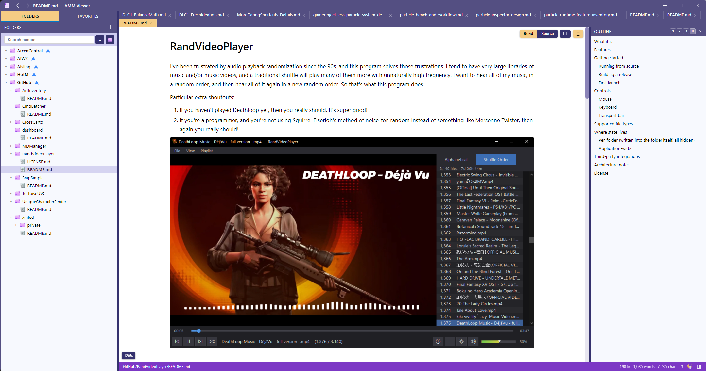
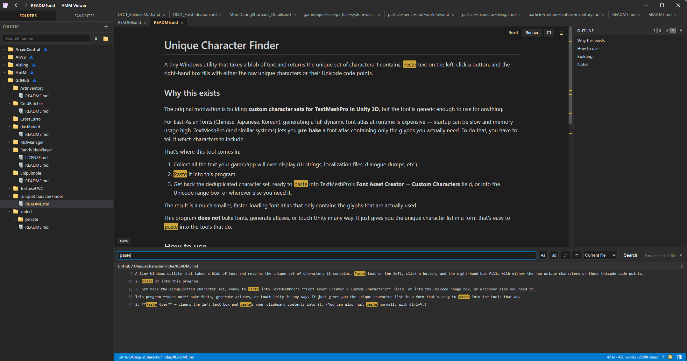

# AMDV — Arcen MD Viewer

A fast, portable desktop viewer (and editor) for trees of **Markdown**
documents — design docs, handoffs, notes, references.

AMDV is the Markdown counterpart to [AXE](https://github.com/x4000/xmled), the
Arcen XML Editor: same look and feel, but aimed at reading and writing Markdown 
instead of schema-aware XML. Point it at one or more folders for a tabbed
reading view with a live rendered preview, a source editor when you want to make
quick edits, full-text search-and-replace across everything, an outline rail,
wiki-style links between documents, and so on. The general idea is to have one
place you can manage all the markdown files from your whole computer, comfortably,
regardless of where they are. But it also supports simply being a tool that opens
arbitrary markdown files if you set it to be your system default for that file
format.

It renders **GitHub-flavored Markdown**: tables, task lists, fenced code with
syntax highlighting, and **Mermaid** diagrams.

## Screenshots

Light mode:

Dark mode:

---

## What it does

- **Read + Source per document** — a rendered preview for reading, and a
  CodeMirror 6 source editor for quick edits. Toggle either tab with **Ctrl+E**;
  each remembers its own scroll position.
- **GitHub-flavored Markdown** — tables, task lists, fenced code with
  highlighting, and Mermaid diagrams, all sanitized on render.
- **Wiki-links & backlinks** — link between documents with `[[Document Name]]`;
  every page shows which other documents link to it.
- **Outline rail** — a live table of contents docked on the right, with the
  current section highlighted as you scroll and a depth control to fold deeper
  headings away. Click a heading to jump.
- **Tabs & tear-off windows** — drag tabs to reorder, or tear one off into its
  own window. Unsaved edits ride along with the tab — nothing is lost. Windows
  share theme and zoom.
- **Folder tree** — open any number of root folders. Create, rename, or delete
  files and folders right from the tree (deletes go to the **Recycle Bin**, not
  oblivion), and drag files between folders or roots. On Windows, Ctrl+right-click
  a folder for the **native shell menu** (TortoiseSVN / TortoiseGit, etc.), and
  use the blue "parent" icon on a root for its containing folder's menu.
- **Favorites** — collect documents into named groups; drag to reorder or move
  between groups.
- **Search & replace** — full-text search across every root, with find-and-replace
  on disk, search history, and per-file replace. Matches are highlighted in the
  results, in the open document, and as ticks on the scrollbar.
- **At-a-glance scrollbar** — overview markers show every search hit and every
  edited (unsaved) line down the scrollbar; the source editor also shows a change
  bar in the gutter.
- **Live reload** — edit a file in another tool and the view updates in place.
- **Authoring help (Source mode)** — smart list continuation, list indent with
  Tab, auto-paired brackets, paste-a-URL-onto-selection to make a link, bold /
  italic / link shortcuts, select-line, go-to-line, and right-click case
  transforms (UPPER / lower / Title / Sentence).
- **OS integration** — make AMDV your default `.md` handler and double-clicking a
  Markdown file anywhere opens it as a tab (or focuses it if already open); or
  just drag files from your file manager onto the window.
- **Themes & zoom** — light and dark, with per-document scaling.

Press **F1** at any time (or the **?** in the status bar) for the full list of
keyboard shortcuts.

AMDV keeps all its settings centrally, mirroring AXE's convention:
`%APPDATA%/ArcenSettings/MDManager/` on Windows (and the platform equivalent
elsewhere). The app folder itself stays fully portable.

---

## Quick start (using a prebuilt binary)

No install or build step — the download is a self-contained app folder.

### Windows
1. Download the latest Windows zip from the Releases page.
2. Extract it anywhere (it's fully portable — settings live in
   `%APPDATA%/ArcenSettings/MDManager/`).
3. Run **`AMMViewer.exe`**.
4. On first run, click **＋ Add folder** in the sidebar and point it at a folder
   of Markdown files.

*(Optional)* To open `.md` files by double-clicking them in Explorer, set AMDV as
the default handler once: right-click any `.md` → **Open with → Choose another
app → AMMViewer → Always**. It's never required — AMDV works fine without being
the default.

### Linux
1. Download the latest `AMMViewer-linux.tar.gz` from the Releases page.
2. Extract: `tar -xzf AMMViewer-linux.tar.gz`.
3. Run it: `cd AMMViewer-linux && ./AMMViewer` (or launch the AppImage if that's
   what you downloaded — `chmod +x AMMViewer*.AppImage` then run it).
4. On first run, **＋ Add folder** and point it at a folder of Markdown files.

### macOS
1. Download the latest `AMMViewer-mac-x64.tar.gz` (Intel) or
   `AMMViewer-mac-arm64.tar.gz` (Apple Silicon) from the Releases page.
2. Extract: `tar -xzf AMMViewer-mac-*.tar.gz`.
3. **First run only**, bypass Gatekeeper since the build isn't Apple-notarized:
   - Right-click the `.app` → **Open** → confirm **Open**, OR
   - Run `xattr -dr com.apple.quarantine AMMViewer.app` once in Terminal.
4. Afterward launch it normally (`open AMMViewer.app`).
5. On first run, **＋ Add folder** and point it at a folder of Markdown files.

---

## Using it

A quick tour of the day-to-day flow:

- **Open a folder.** Click **＋ Add folder** in the sidebar, pick a directory, and
  its `.md` files appear as a tree. Add as many roots as you like; double-click a
  root's name to give it a nickname, and drag a root up or down to reorder them.
- **Read & edit.** Click a file to open it in a tab. Use the **Read / Source**
  buttons (or **Ctrl+E**) to switch between the rendered view and the editor.
  **Ctrl+S** saves.
- **Navigate.** The outline rail (☰) lists headings — click to jump. Wiki-links
  and relative links are clickable; the mouse back/forward buttons retrace your
  steps. **Ctrl+G** jumps to a line.
- **Search.** **Ctrl+Shift+F** searches every folder; **Ctrl+F** searches the
  current file; **Ctrl+H** opens find-and-replace. Matches light up in the
  results, in the document, and on the scrollbar; click a result to jump there.
- **Organize.** Right-click files and folders to create, rename, delete (to the
  Recycle Bin), or reveal them; drag files between folders. Star documents into
  **Favorites** groups and drag them into the order you want.
- **Windows & tabs.** Drag a tab out to tear it into its own window. **Ctrl+Tab**
  cycles tabs; **Ctrl+W** closes one.

Press **F1** for the complete keyboard-shortcut reference.

---

## License

MIT — see [`LICENSE`](LICENSE).
